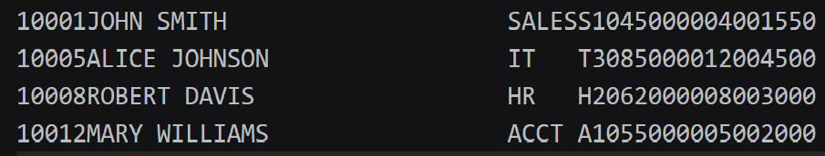
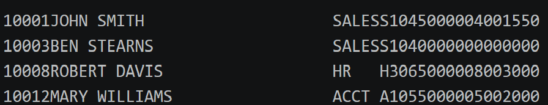
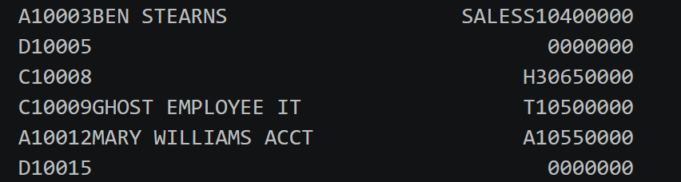
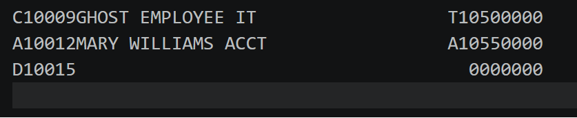

# SEQ3000
 

---

## 👤 Author
Ben Stearns - [@bstearns07](https://github.com/bstearns07) 

📅 **Last Updated:** 4/23/2026

---

## 📑 Table of Contents
- 📌 [Summary](#-summary)
- ⭐ [How It Works](#-how-it-works)
- ✨ [Features](#-features)
- 🧾 [File Layouts](#-file-layouts)
- 🧰 [Tech Stack](#-tech-stack)
- 🔧 [Development Tools](#-development-tools)
- 🧩 [Core Concepts](#-core-concepts)
- 📝 [New Topics Covered](#-new-topics-covered)
- 📘 [What I Learned](#-what-i-learned)
- 🖼 [Screenshots](#-screenshots)

---

## 📌 Summary

Welcome the the SEQ3000 COBOL program. This is something different from all the other COBOL projects I've done so far. The overall
purpose of this program to show how you can utilize COBOL to add/edit/delete information in one file based on instrutions from another file.
This is demonstrated for both a sequential file acting as the main data storage and an index file as main data storage.

There are 4 main files we're working with:
1. OLDEMP/EMPMASTI: represents the old data records without any updates made to them (OLDEMP = sequential file, EMPMASTI = index file).
2. NEWEMP: represents the old file after add/edit/deletes have been made so you can see the change as a new sequential file
3. EMPTRAN: the instruction on what changes to make (has intentially bad instructions to test that error logging works)
4. ERRTRAN3: displays any errors that occurred during the update process

For full program details, refer to [Program Requirements](./assets/AssignmentInstructions.pdf) 

---

## ⭐ How It Works

### Run with Sequential File Storage

1. **Upload files**
   - `SEQ3000.cbl`
   - `JCLSEQ3.jcl`
   - All `.DAT` files from the `input_data` folder

2. **Update file paths**
   - Edit `JCLSEQ3.jcl`
   - Modify all **DSN names** to match your environment

3. **Submit job**
   - Run the `JCLSEQ3.jcl` job

4. **Verify results**
   - Changes appear in `NEWEMP`
   - `OLDEMP` remains unchanged for comparison

---

### Run with Indexed File Storage

1. **Upload files**
   - All files from `using_sequential_files`
   - All files from `input_data`

2. **Update file paths**
   - Edit all JCL files
   - Update **DSN names** to match your environment

3. **Create indexed file**
   - Submit `JCLSEQI.jcl`

4. **View indexed file**
   - Submit `JCLPVSAM.jcl`
   - Check output in SYSOUT

5. **Apply updates**
   - Submit `JCLSEQI2.jcl`

6. **Verify results**
   - Submit `JCLPVSAM.jcl` again
   - Review updated contents in SYSOUT
   
---

## ✨ Features

- Demonstrates CRUD fuctions (create, read, update, delete) functions to update a file
- Error handling and logging if errors occurs during file update
- Conditional switches to control program flow
- Fixed-block records for data
- Record matching logic to properly match an old record with a transaction record
- All features demonstated for both index and sequential files
  
---

## 🧾 File Layouts

### 🧾 Old Master File Layout (EMPLOYEE-MASTER-RECORD)

| Field Name           | COBOL Name           | PIC Clause   | Length | Description                        |
|----------------------|---------------------|--------------|--------|-------------------------------------|
| Employee ID          | EM-EMPLOYEE-ID      | X(5)         | 5      | Unique ID identifying the employee  |
| Employee Name        | EM-EMPLOYEE-NAME    | X(30)        | 30     | Employee full name                  |
| Department Code      | EM-DEPART-CODE      | X(5)         | 5      | Unique ID for employee's department |
| Job Class            | EM-JOB-CLASS        | X(2)         | 2      | Job classification code             |
| Annual Salary        | EM-ANNUAL-SALARY    | 9(5)V99      | 7      | Salary (implied 2 decimal places)   |
| Vacation Hours       | EM-VACATION-HOURS   | 9(3)         | 3      | Accrued vacation hours              |
| Sick Hours           | EM-SICK-HOURS       | 9(3)V99      | 5      | Accrued sick hours (2 decimals)     |

*Total Record Length: 50 bytes*

---

### 🧾 Transaction File Layout (EMPLOYEE-TRANSACTION)

| Field Name           | COBOL Name           | PIC Clause   | Length | Description                                 |
|----------------------|---------------------|--------------|--------|---------------------------------------------|
| Transaction Code     | ET-TRANSACTION-CODE | X(1)         | 1      | A = Add, C = Change, D = Delete             |
| Employee ID          | ET-EMPLOYEE-ID      | X(5)         | 5      | Target employee identifier                  |
| Employee Name        | ET-EMPLOYEE-NAME    | X(30)        | 30     | Updated name (for Add/Change)               |
| Department Code      | ET-DEPART-CODE      | X(5)         | 5      | Updated department                          |
| Job Class            | ET-JOB-CLASS        | X(2)         | 2      | Updated job classification                  |
| Annual Salary        | ET-ANNUAL-SALARY    | 9(5)V99      | 7      | Updated salary (2 implied decimals)         |

*Total Record Length: 50 bytes*

---

### 🧾 New Master File Layout (NEW-MASTER-RECORD)

| Field Name           | COBOL Name           | PIC Clause   | Length | Description                         |
|----------------------|---------------------|--------------|--------|-------------------------------------|
| Employee ID          | NM-EMPLOYEE-ID      | X(5)         | 5      | Unique employee identifier          |
| Employee Name        | NM-EMPLOYEE-NAME    | X(30)        | 30     | Employee full name                  |
| Department Code      | NM-DEPART-CODE      | X(5)         | 5      | Department identifier               |
| Job Class            | NM-JOB-CLASS        | X(2)         | 2      | Job classification code             |
| Annual Salary        | NM-ANNUAL-SALARY    | 9(5)V99      | 7      | Salary (2 implied decimal places)   |
| Vacation Hours       | NM-VACATION-HOURS   | 9(3)         | 3      | Accrued vacation hours              |
| Sick Hours           | NM-SICK-HOURS       | 9(3)V99      | 5      | Accrued sick hours (2 decimals)     |

*Total Record Length: 57 bytes*

---

## 🧰 Tech Stack

- **Enterprise COBOL 6.4** – Core business logic  
- **JCL** – Batch execution (compile/link/run)  
- **IBM z/OS** – Mainframe runtime environment  

---

## 🔧 Development Tools
- 💻 Visual Studio Code + Zowe Explorer  
- 🖥️ IBM z/OS Mainframe  
- 📂 Partitioned Datasets (PDS)

---

### 🧩 Core Concepts
- Index file creation/management
- Error logging/handling of index file management
- Using a transaction file to update another file

## 📝 New Topics Covered

1. Adding, reading, updating, and delete records from a file
2. How to perform error handling when manipulating a file
3. FILE-STATUS statements for capturing error codes
4. Creating COBOL and JCL files that create an index file from a sequential file
5. Setting a lookup key to lookup records in an index file

---

## 📘 What I Learned
This project introduced me to the world of COBOL programs that update data contained in sequential and index files. Up until now I've only read data from files rather than changing that data. This required a fine balance of reading in two records at a time, cycling through the older file for matching, and performing the right update logic to write the new data without garbage output. This required learning the importance of cleaning out prior byte data so nothing old gets written by the next process. I also learned how to use FILE-STATUS statements to capture error codes for writing error logs. It's also very important to keep your variables straight when working with multiple files. Using the wrong 2-character identifier is all it takes to get totall incorrect results. In summary:

- Keep your variable names and conventions consistent
- Know your procedure workflow structure
- Wipe old data cleanly to prevent carry over into another procedure

---

## 🖼 Screenshots

### Old Master File

### New Master File

### Transaction File

### Error File

